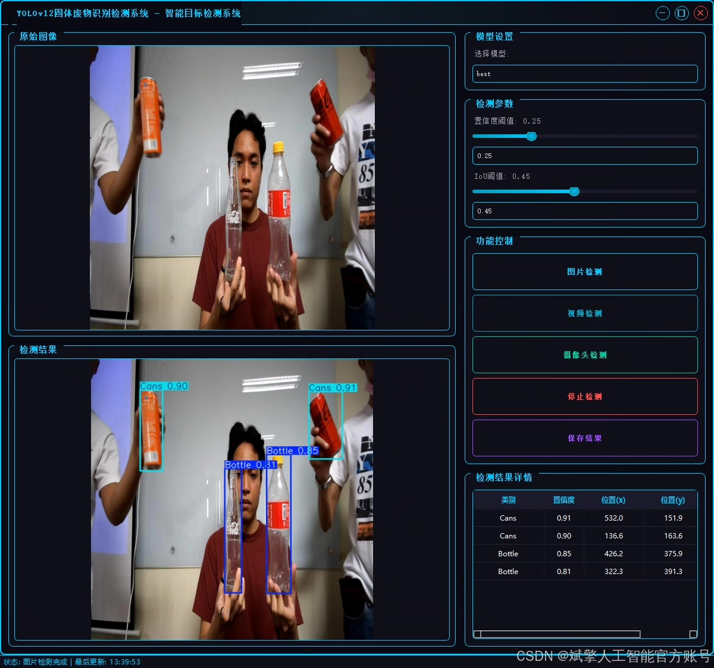
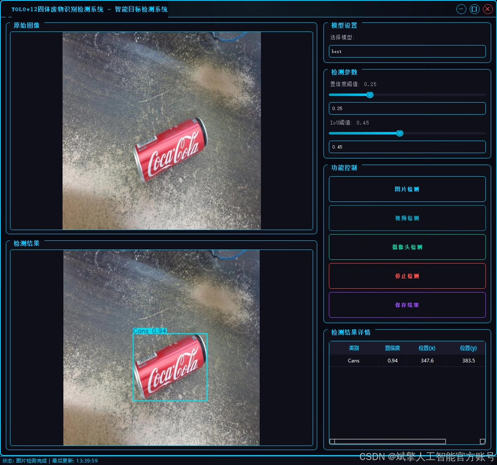
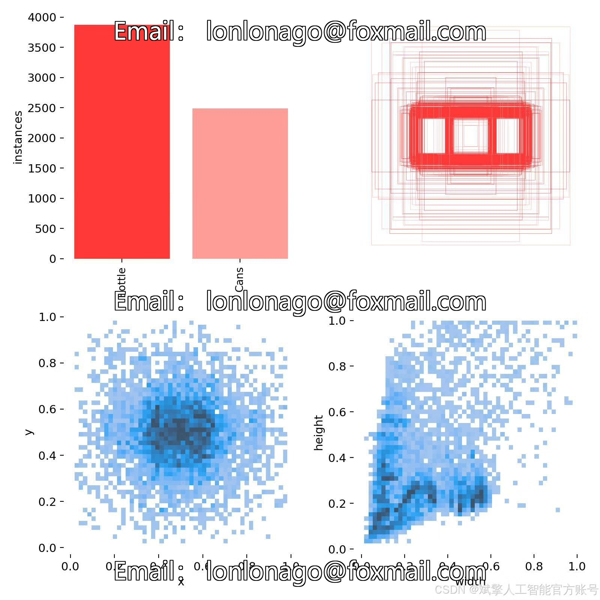
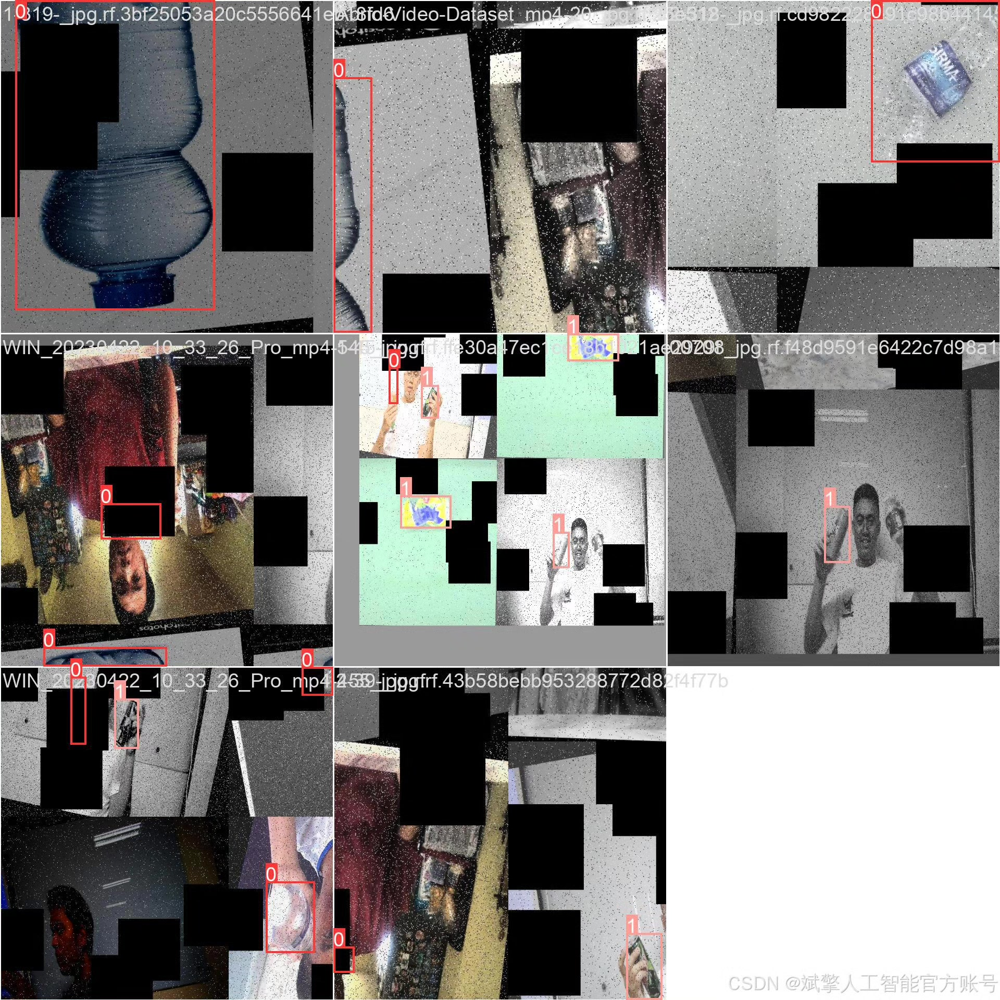
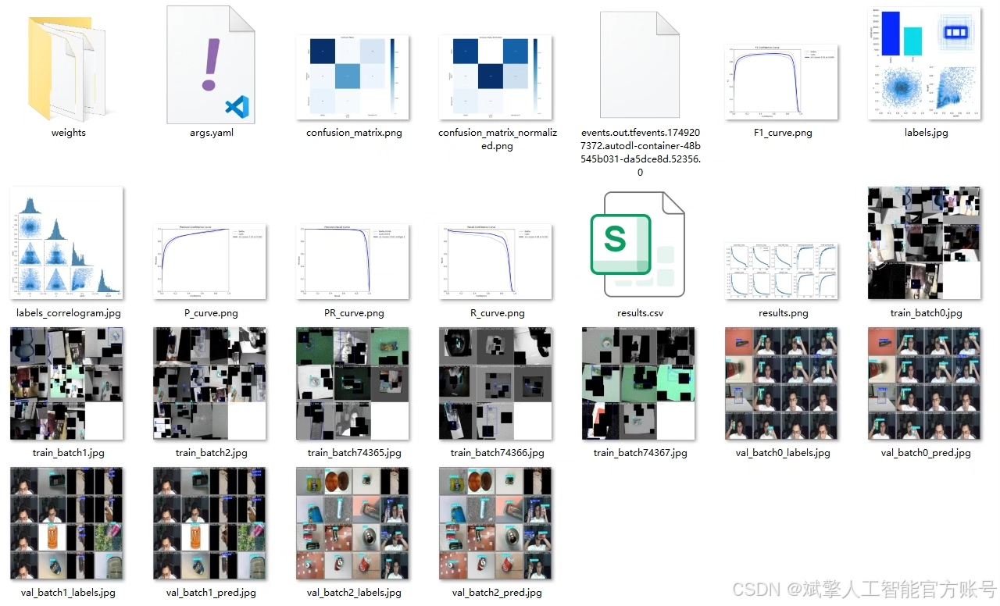
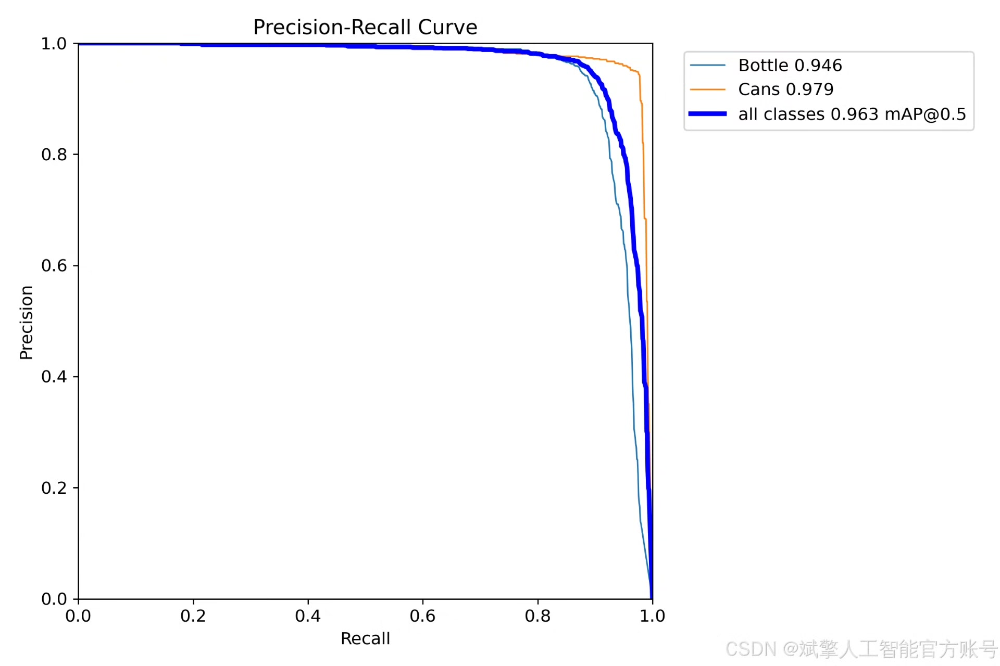
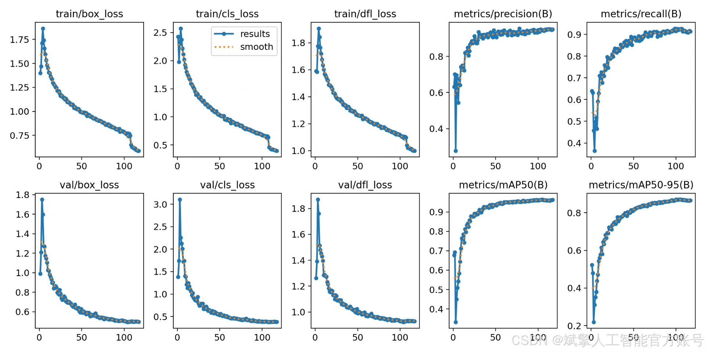
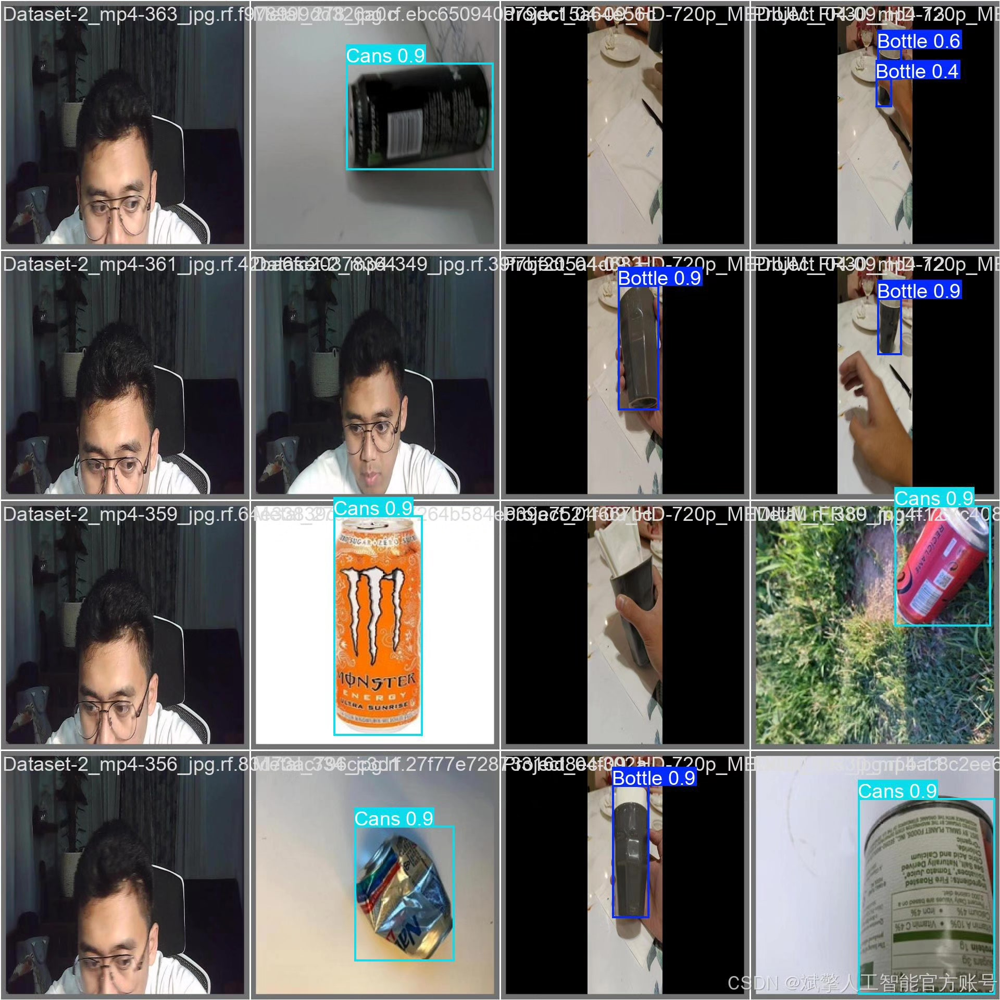

# YOLOv12 Waste Intelligent Identification System

## Body

YOLOv12 Waste Intelligence Identification System Based on Deep Learning YOLOv12 for Solid Waste Recognition and Detection (YOLOv12+YOLO dataset + UI interface + login registration interface + Python project source code + model)

The purpose of this project is to develop a solid waste automatic recognition system based on the cutting-edge target detection model YOLOv12. The system focuses on high-precision, real-time detection and localization of two most common recyclables - bottles and cans. Through model training and optimization on a dataset containing nearly 8000 images, the model can effectively learn the visual features of bottle and can types, providing core visual perception capabilities for subsequent automated garbage classification and recycling processes, which is a key technical practice in promoting smart environmental protection and intelligent management of urban waste.

✅ User Login and Registration: Supports password verification and security validation.
✅ Three detection modes: Based on the YOLOv12 model, supports image, video, and real-time camera detection, accurately identifying targets.
✅ Dual-screen comparison: Displays the original scene and detection results on the same screen.
✅ Data visualization: Real-time table displaying the category, confidence, and coordinates of detected targets.
✅ Intelligent parameter adjustment: Offers a confidence slide bar to dynamically optimize detection accuracy, adapting to different scene requirements.
✅ Sci-fi style interactive interface: Dark theme combined with dynamic light effects, reducing visual fatigue and improving operational experience.

## Images

## Payment

Here is a pay link on Stripe ( https://buy.stripe.com/3cs8yP7sY87d0vu9AB ). Please contact me lonlonago@foxmail.com after funding $89, and I will send you a complete data files , thank you!

